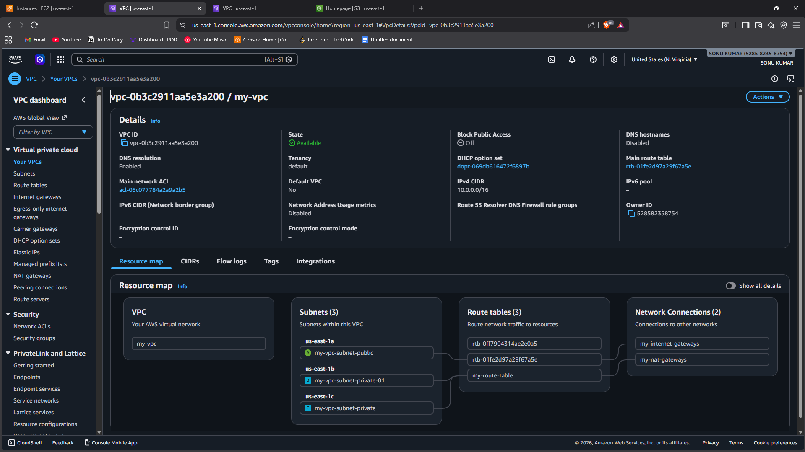
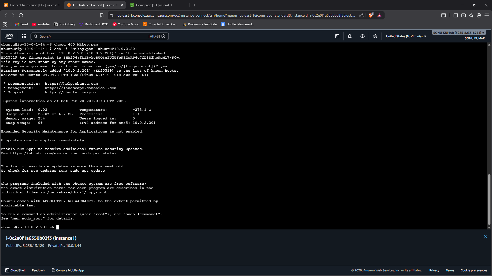
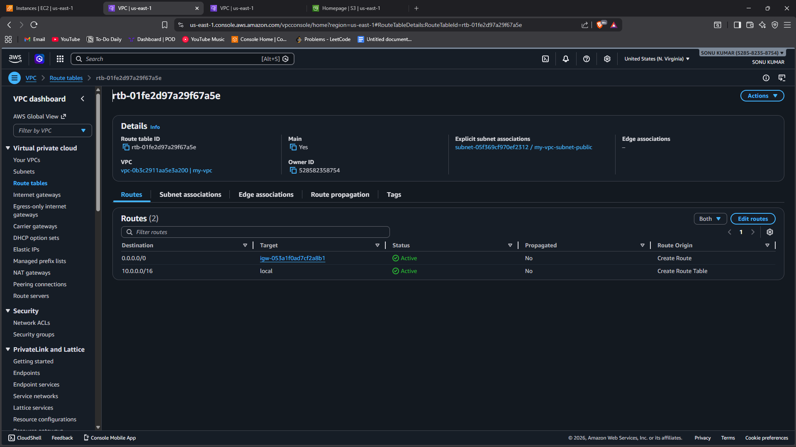

# Task 10 - VPC 3-Tier Architecture

## 📌 Objective
To design and implement a 3-tier VPC architecture with public and private subnets in order to understand AWS networking components such as IGW, NAT Gateway, Route Tables, NACL, and SSH tunneling.

This task demonstrates secure and scalable cloud network design.

---

## 🛠️ Services Used
- Amazon VPC
- Subnets (Public & Private)
- Internet Gateway (IGW)
- NAT Gateway
- Route Tables
- Network ACL (NACL)
- EC2 Instances
- Bastion Host (for SSH tunneling)

---

## 🏗️ Architecture Overview

A 3-tier architecture consists of:

1. Web Tier (Public Subnet)
2. Application Tier (Private Subnet)
3. Database Tier (Private Subnet)

- Public subnet connected to Internet Gateway.
- Private subnets access internet via NAT Gateway.
- Bastion host used to SSH into private instances securely.

---

## 🌍 Implementation Steps

### Step 1: Create VPC
1. Open AWS Console → VPC.
2. Create VPC with CIDR block:
   ```
   10.0.0.0/16
   ```

---

### Step 2: Create Subnets

Create subnets in different Availability Zones:

- Public Subnet: 10.0.1.0/24
- Private App Subnet: 10.0.2.0/24
- Private DB Subnet: 10.0.3.0/24

Enable Auto-assign Public IP only for Public Subnet.

---

### Step 3: Create and Attach Internet Gateway (IGW)

1. Create Internet Gateway.
2. Attach it to the VPC.
3. Update Public Route Table:
   ```
   0.0.0.0/0 → Internet Gateway
   ```

---

### Step 4: Create NAT Gateway

1. Allocate Elastic IP.
2. Create NAT Gateway in Public Subnet.
3. Update Private Route Table:
   ```
   0.0.0.0/0 → NAT Gateway
   ```

Now private instances can access internet securely.

---

### Step 5: Configure Route Tables

- Public Route Table → Associated with Public Subnet.
- Private Route Table → Associated with App & DB Subnets.

---

### Step 6: Configure Security Groups

- Bastion Host (Public Subnet):
  - Allow SSH (Port 22) from your IP.

- App Server (Private Subnet):
  - Allow SSH only from Bastion Host.
  - Allow HTTP from Load Balancer (if configured).

- DB Server:
  - Allow DB port (e.g., 3306) only from App Server.

---

### Step 7: SSH Tunneling (Access Private Instance)

From local machine:

```bash
ssh -i key.pem ubuntu@bastion-public-ip
```

From Bastion Host:

```bash
ssh private-instance-private-ip
```

This allows secure access to private EC2 instances.

---

## 📷 Proof of Work (Screenshots Required)

1. Screenshot showing:
   - VPC with public and private subnets.


2. Screenshot showing:
   - NAT Gateway and Route Tables configuration.



3. Screenshot showing:
   - Successful SSH tunneling from ssh to privae instance.


(All screenshots inside the Screenshots folder.)

---

## 🔐 Key Networking Concepts Learned

### 🌐 Internet Gateway (IGW)
Allows public subnet resources to access the internet.

### 🔁 NAT Gateway
Allows private subnet instances to access internet without exposing them publicly.

### 🛡️ Network ACL (NACL)
Acts as subnet-level firewall.

### 🔒 Bastion Host
Secure jump server to access private instances.

---

## 📊 Why 3-Tier Architecture is Important

- Improves security by isolating database layer.
- Enables scalability and high availability.
- Follows real-world production architecture.
- Separates presentation, logic, and data layers.

---

## 🎯 Conclusion

In this task, a secure 3-tier VPC architecture was successfully implemented with public and private subnets, NAT Gateway, and SSH tunneling.

This demonstrates practical cloud networking design and secure infrastructure setup in AWS.