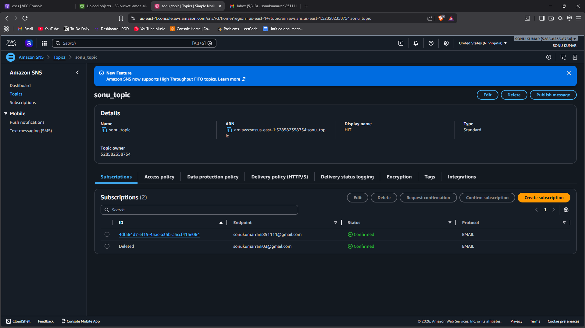
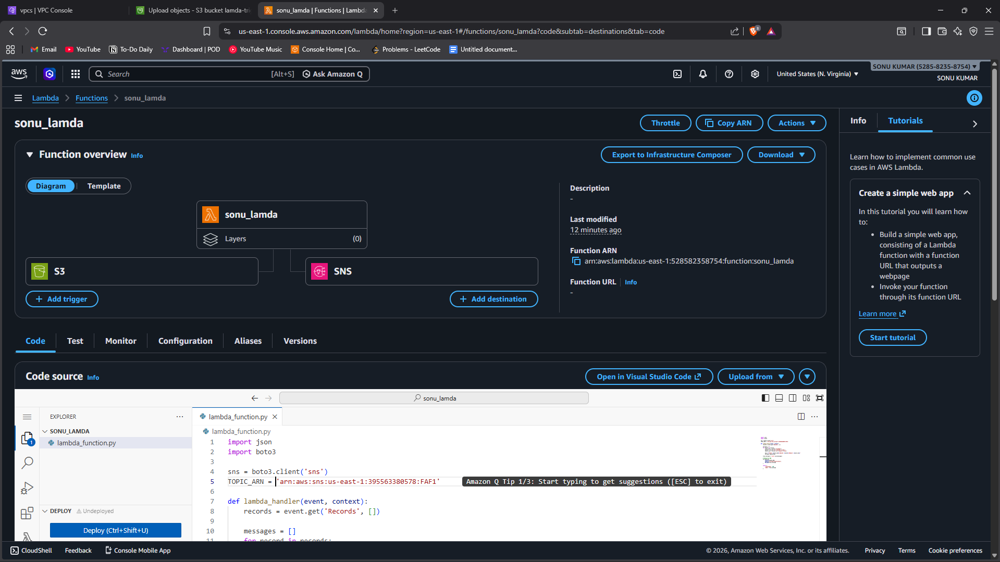
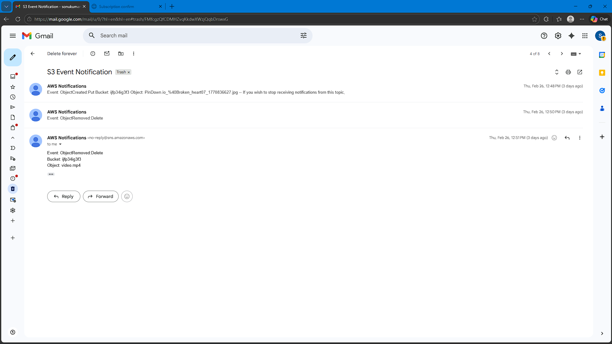

# Task 11 - S3 Upload Email Notification (Lambda + SNS)

## 📌 Objective
To trigger an email notification whenever a file is uploaded to an S3 bucket using AWS Lambda and SNS.

This task demonstrates event-driven architecture in AWS.

---

## 🛠️ Services Used
- Amazon S3
- AWS Lambda
- Amazon SNS (Simple Notification Service)
- IAM Role

---

## 🧠 Architecture Flow

1. File uploaded to S3 bucket.
2. S3 triggers Lambda function.
3. Lambda publishes message to SNS topic.
4. SNS sends email notification.

This is a serverless, event-driven workflow.

---

## 🌍 Implementation Steps

### Step 1: Create SNS Topic

1. Open AWS Console → SNS.
2. Click **Create Topic**.
3. Choose **Standard Topic**.
4. Enter topic name (e.g., S3-Upload-Notification).
5. Create topic.
6. Create subscription:
   - Protocol: Email
   - Endpoint: Your email address.
7. Confirm subscription from your email.

---

### Step 2: Create IAM Role for Lambda

1. Open IAM → Roles.
2. Create role for AWS service.
3. Select Lambda.
4. Attach policies:
   - AmazonS3ReadOnlyAccess
   - AmazonSNSFullAccess
5. Create role.

---

### Step 3: Create Lambda Function

1. Open AWS Console → Lambda.
2. Click **Create function**.
3. Select **Author from scratch**.
4. Runtime: Python 3.x
5. Attach created IAM role.

---

### Step 4: Add Lambda Code

Example Python code:

```python
import json
import boto3

sns = boto3.client('sns')

def lambda_handler(event, context):
    bucket = event['Records'][0]['s3']['bucket']['name']
    file_name = event['Records'][0]['s3']['object']['key']
    
    message = f"File {file_name} has been uploaded to bucket {bucket}"
    
    sns.publish(
        TopicArn='arn:aws:sns:region:account-id:S3-Upload-Notification',
        Message=message,
        Subject='S3 File Upload Alert'
    )
    
    return {
        'statusCode': 200,
        'body': json.dumps('Notification sent successfully!')
    }
```

(Replace region, account-id, and topic name accordingly.)

---

### Step 5: Configure S3 Event Trigger

1. Open S3 bucket.
2. Go to **Properties → Event notifications**.
3. Click **Create event notification**.
4. Event type:
   - All object create events.
5. Destination:
   - Lambda function.
6. Select the created Lambda function.
7. Save configuration.

---

### Step 6: Test the Setup

1. Upload a file to S3 bucket.
2. Check Lambda logs in CloudWatch.
3. Verify email received from SNS.

---

## 📷 Proof of Work (Screenshots Required)

1. Screenshot showing:
   - SNS topic and email subscription.


2. Screenshot showing:
   - Lambda function with S3 trigger configured.


3. Screenshot showing:
   - Email notification received after file upload.


(All screenshots inside the Screenshots folder.)

---

## 🔍 Key Concepts Learned

### ⚡ Event-Driven Architecture
- System reacts automatically to events.
- No manual intervention required.

### 📨 SNS
- Sends notifications via email, SMS, etc.

### 🧩 Lambda
- Serverless compute service.
- Executes code only when triggered.

---

## 📊 Why This is Important

- Used in automation workflows.
- Enables real-time alerts.
- Reduces operational overhead.
- Common in DevOps and cloud monitoring systems.

---

## 🎯 Conclusion

In this task, an event-driven workflow was successfully implemented where an S3 upload triggered a Lambda function, which published a notification via SNS.

This demonstrates practical serverless automation using AWS services.