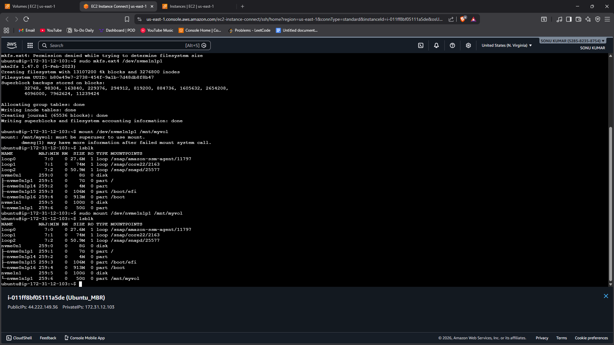
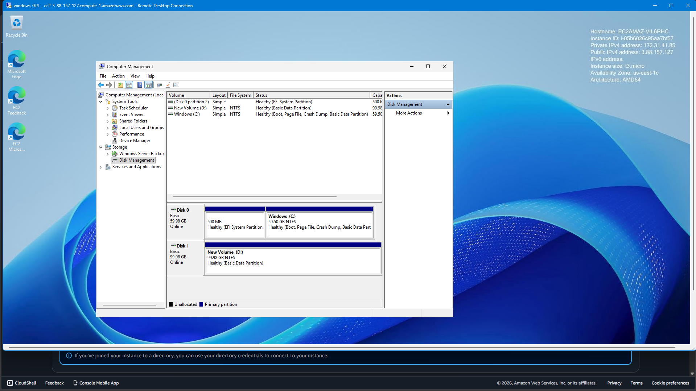

# Task 2 - Disk Partitioning (Ubuntu – MBR & Windows – GPT)

## 📌 Objective
To understand disk structure and perform disk partitioning using:
- MBR (Master Boot Record) in Ubuntu (Linux)
- GPT (GUID Partition Table) in Windows

This task demonstrates how storage devices are structured and managed in different operating systems.

---

## 🖥️ Part 1: Ubuntu – MBR Partitioning

### Tool Used:
- fdisk (Linux disk partitioning utility)

### Steps Performed:

1. Attached an additional disk to the Ubuntu system.
2. Verified disk using:
3. Opened disk utility:
4. Created new partition using `n`
5. Selected primary partition.
6. Saved changes using `w`
7. Formatted partition:
8. Mounted partition:

### Result:
Successfully created and mounted an MBR partition in Ubuntu.

---

## 🪟 Part 2: Windows – GPT Partitioning

### Tool Used:
- Windows Disk Management

### Steps Performed:

1. Opened Run → Typed `diskmgmt.msc`
2. Initialized new disk.
3. Selected **GPT (GUID Partition Table)** as partition style.
4. Created new simple volume.
5. Assigned drive letter.
6. Formatted with NTFS file system.

### Result:
Successfully created and formatted GPT partition in Windows.

---

## 📷 Proof of Work (Screenshots Required)

1. Ubuntu Terminal showing:
- `fdisk` partition creation
- `lsblk` output

2. Windows Disk Management showing:
- GPT disk
- Created volume

---

## 🔍 Key Difference: MBR vs GPT

| Feature | MBR | GPT |
|----------|------|------|
| Max Disk Size | 2 TB | 9.4 ZB |
| Max Partitions | 4 Primary | 128 Partitions |
| Boot Mode | Legacy BIOS | UEFI |
| Reliability | Less | More (Backup partition table) |

---

## 🎯 Conclusion

In this task, disk partitioning was successfully performed using:
- MBR in Ubuntu via fdisk
- GPT in Windows via Disk Management

This helped in understanding disk structure, partition styles, and storage management in Linux and Windows environments.