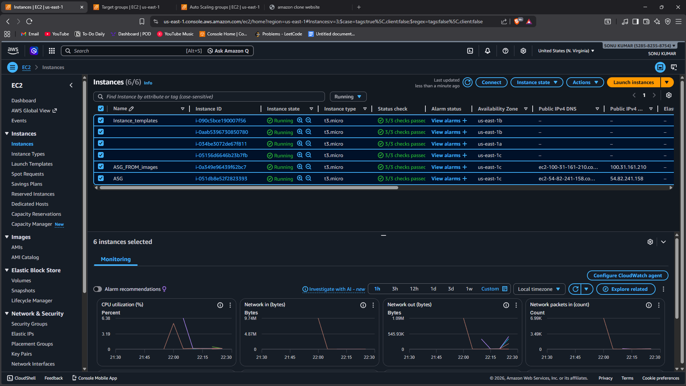
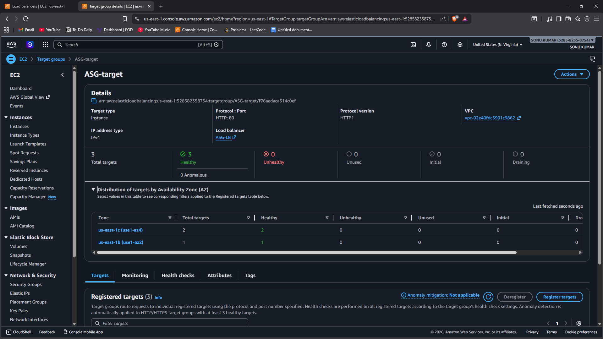
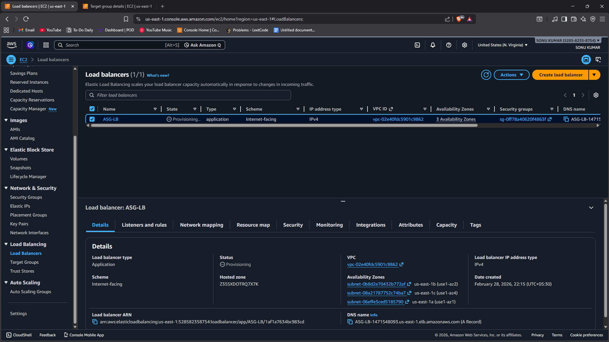
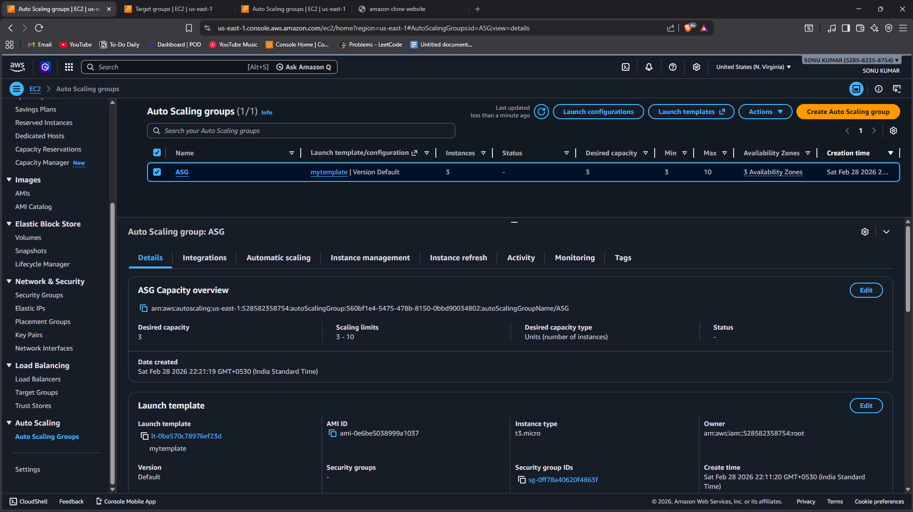

# Task 4 - Auto Scaling Group (ASG) and Elastic Load Balancer (ELB) in EC2

## 📌 Objective
To configure an Auto Scaling Group (ASG) with an Elastic Load Balancer (ELB) in order to understand high availability, fault tolerance, and automatic scaling in AWS.

This task demonstrates how AWS maintains application availability during traffic spikes and instance failures.

---

## 🛠️ Services Used
- Amazon EC2
- Launch Template
- Auto Scaling Group (ASG)
- Application Load Balancer (ELB)
- Target Group

---

## 🖥️ Implementation Steps

### Step 1: Create Launch Template
1. Opened EC2 Dashboard → Launch Templates.
2. Created a new launch template.
3. Selected AMI (Ubuntu).
4. Selected instance type (e.g., t3.micro).
5. Configured Security Group (Allowed HTTP - Port 80).
6. Added User Data script to install nginx:

sudo apt update -y
sudo apt install nginx -y
sudo systemctl start nginx
sudo systemctl status nginx
git clone https://github.com/priyanshusharma1902/Amazon-Clone.git
sudo cp -r Amazon-Clone/* /var/www/html

7. Created the launch template.

---

### Step 2: Create Target Group
1. Opened EC2 → Target Groups.
2. Created a new target group.
3. Selected target type: Instances.
4. Protocol: HTTP (Port 80).
5. Selected VPC.
6. Created target group.

---

### Step 3: Create Application Load Balancer
1. Opened EC2 → Load Balancers.
2. Selected Application Load Balancer.
3. Configured:
- Scheme: Internet-facing
- Listener: HTTP (Port 80)
- Selected at least two Availability Zones.
4. Attached previously created target group.
5. Created Load Balancer.

---

### Step 4: Create Auto Scaling Group
1. Opened EC2 → Auto Scaling Groups.
2. Selected created launch template.
3. Selected VPC and multiple Availability Zones.
4. Attached Load Balancer.
5. Configured scaling:
- Minimum capacity: 3
- Desired capacity: 3
- Maximum capacity: 10
6. Created Auto Scaling Group.

---

### Step 5: Testing
1. Accessed Load Balancer DNS name in browser.
2. Verified web page response.
3. Increased load or manually terminated one instance.
4. Observed ASG automatically launching a new instance.

---

## 📷 Proof of Work 

1. Screenshot showing Launch Template and ASG configuration.
2. Screenshot showing Load Balancer and Target Group.
3. Screenshot showing multiple EC2 instances running and healthy.

(All screenshots inside the Screenshots folder.)

---

## 🔍 Key Learning

- Load Balancer distributes traffic across multiple EC2 instances.
- Auto Scaling automatically increases or decreases instances based on demand.
- High Availability is achieved using multiple Availability Zones.
- Fault tolerance ensures service remains available even if one instance fails.

---

## 🎯 Conclusion

In this task, an Auto Scaling Group was successfully configured with an Application Load Balancer.  
The system maintained availability by distributing traffic and automatically replacing failed instances.

This setup demonstrates real-world cloud architecture for scalable and highly available applications.