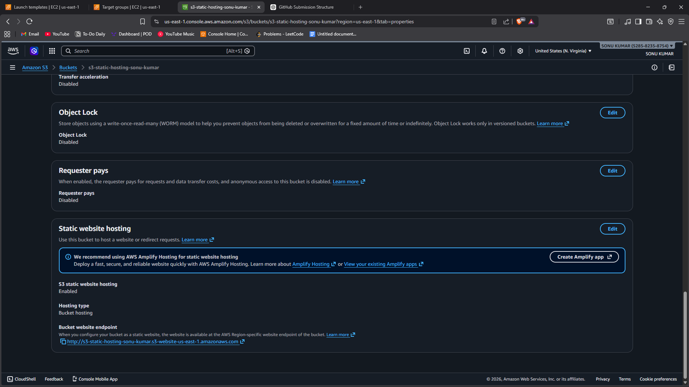
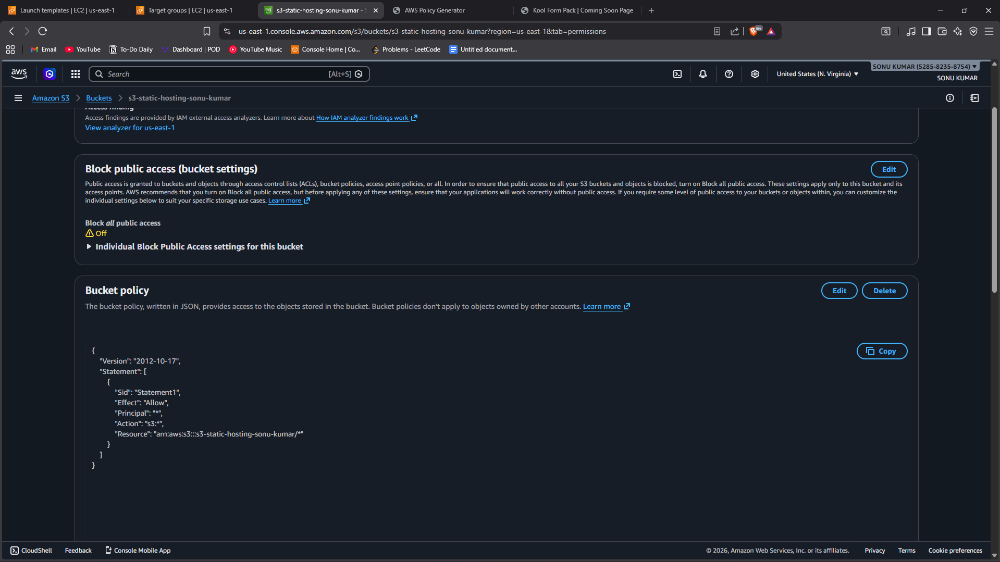

# Task 5 - Static Website Hosting using Amazon S3

## 📌 Objective
To host a static website using Amazon S3 and understand serverless hosting concepts in AWS.

This task demonstrates how S3 can be used to host HTML, CSS, and JavaScript files without using EC2.

---

## 🛠️ Service Used
- Amazon S3 (Simple Storage Service)

---

## 🌐 Implementation Steps

### Step 1: Create S3 Bucket
1. Open AWS Console → S3.
2. Click **Create Bucket**.
3. Enter a unique bucket name.
4. Select region.
5. Disable "Block all public access".
6. Create the bucket.

---

### Step 2: Upload Website Files
1. Open the created bucket.
2. Click **Upload**.
3. Upload:
   - index.html
   - style.css (if used)
   - images or JS files
4. Complete upload process.

---

### Step 3: Enable Static Website Hosting
1. Open bucket → Properties.
2. Scroll to **Static Website Hosting**.
3. Click **Edit**.
4. Enable static website hosting.
5. Set:
   - Index document: index.html
6. Save changes.

---

### Step 4: Add Bucket Policy (Public Access)

Replace `your-bucket-name` with your actual bucket name.

```json
{
  "Version": "2012-10-17",
  "Statement": [
    {
      "Sid": "PublicReadGetObject",
      "Effect": "Allow",
      "Principal": "*",
      "Action": "s3:GetObject",
      "Resource": "arn:aws:s3:::your-bucket-name/*"
    }
  ]
}
```

---

### Step 5: Access Website
1. Copy the **Bucket Website Endpoint**.
2. Open it in a browser.
3. Verify that the website loads successfully.

---

## 📷 Proof of Work (Screenshots Required)

1. Screenshot showing:
   - Static Website Hosting enabled


   - Bucket policy configured


2. Screenshot showing:
   - Website successfully accessed via S3 endpoint in browser

---

## 🔍 Key Learning

- S3 provides serverless hosting.
- No EC2 or server management required.
- Highly scalable and cost-effective.
- Suitable for static websites only (HTML, CSS, JS).

---

## 🎯 Conclusion

Static website hosting was successfully implemented using Amazon S3.  
Public access was configured properly, and the website was accessible via the S3 endpoint.

This demonstrates a serverless and scalable hosting solution in AWS.