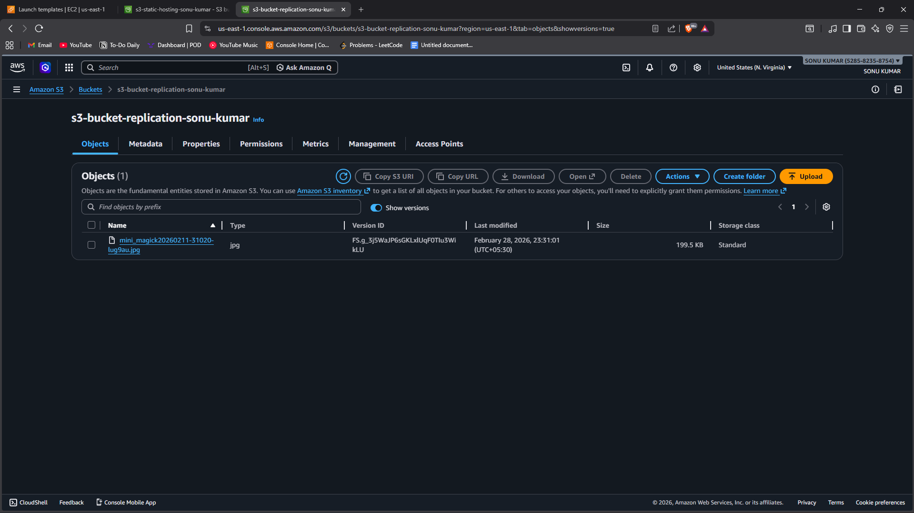
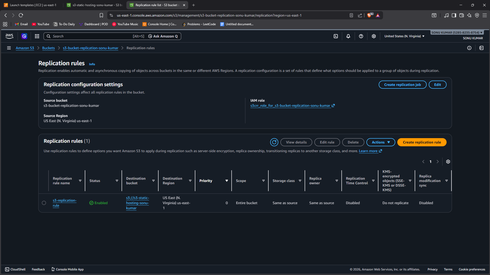
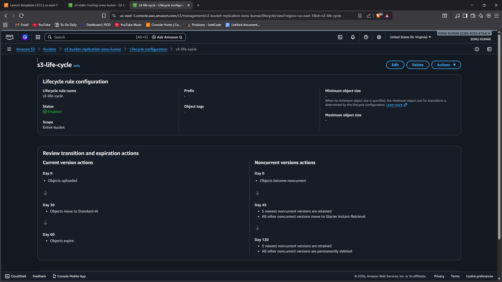

# Task 6 - S3 Replication and Lifecycle Policy

## 📌 Objective
To configure S3 Replication and Lifecycle policies in order to understand backup strategy and cost optimization in AWS.

This task demonstrates how data can be automatically replicated to another bucket and how lifecycle rules help reduce storage costs.

---

## 🛠️ Services Used
- Amazon S3
- Versioning
- Replication Rules
- Lifecycle Policies
- IAM Role (for replication)

---

## 🌍 Implementation Steps

### Step 1: Create Source and Destination Buckets
1. Open AWS Console → S3.
2. Create **Source Bucket**.
3. Create **Destination Bucket** (can be in same or different region).
4. Ensure bucket names are globally unique.

---

### Step 2: Enable Versioning
1. Open Source Bucket → Properties.
2. Enable **Versioning**.
3. Open Destination Bucket → Properties.
4. Enable **Versioning**.

(Note: Versioning must be enabled on both buckets before replication.)

---

### Step 3: Configure Replication Rule
1. Open Source Bucket → Management.
2. Select **Replication Rules** → Create rule.
3. Choose:
   - Apply to all objects (or specific prefix).
4. Select Destination Bucket.
5. Create or select IAM Role for replication.
6. Save rule.

Now, any new object uploaded to Source Bucket will automatically replicate to Destination Bucket.

---

### Step 4: Configure Lifecycle Policy
1. Open Source Bucket → Management.
2. Select **Lifecycle Rules** → Create rule.
3. Rule configuration:
   - Apply to all objects.
4. Add transition action:
   - Move to Standard-IA after 30 days.
   - Move to Glacier after 60 days.
5. Optionally enable:
   - Expire objects after 365 days.
6. Save rule.

Lifecycle policies automatically optimize storage cost.

---

### Step 5: Testing
1. Upload a file to Source Bucket.
2. Verify file appears in Destination Bucket.
3. Confirm replication status.
4. Check lifecycle rule configuration.

---

## 📷 Proof of Work (Screenshots Required)

1. Screenshot showing:
   - Versioning enabled on both buckets.

2. Screenshot showing:
   - Replication rule configuration.

3. Screenshot showing:
   - Lifecycle rule setup.

(All screenshots inside the Screenshots folder.)

---

## 🔍 Key Concepts Learned

### 🔁 Replication
- Automatically copies objects from one bucket to another.
- Used for backup and disaster recovery.
- Can replicate across regions (Cross-Region Replication).

### 💰 Lifecycle Policy
- Moves objects to cheaper storage classes.
- Helps reduce long-term storage cost.
- Can automatically delete old data.

---

## 📊 Why This is Important

- Ensures data redundancy.
- Improves disaster recovery strategy.
- Optimizes AWS storage cost.
- Automates data management.

---

## 🎯 Conclusion

In this task, S3 versioning was enabled, replication was configured between two buckets, and lifecycle rules were applied for cost optimization.

This demonstrates practical implementation of backup strategy and automated storage management in AWS.