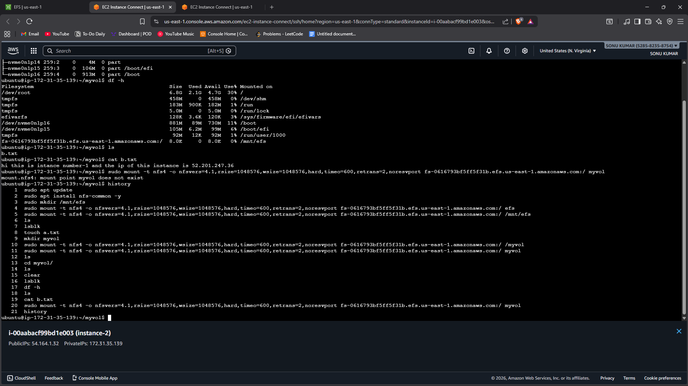
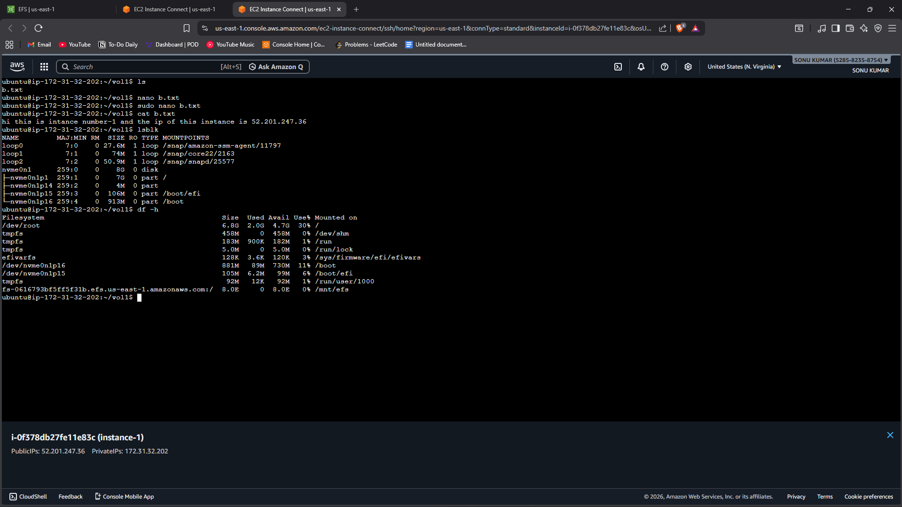
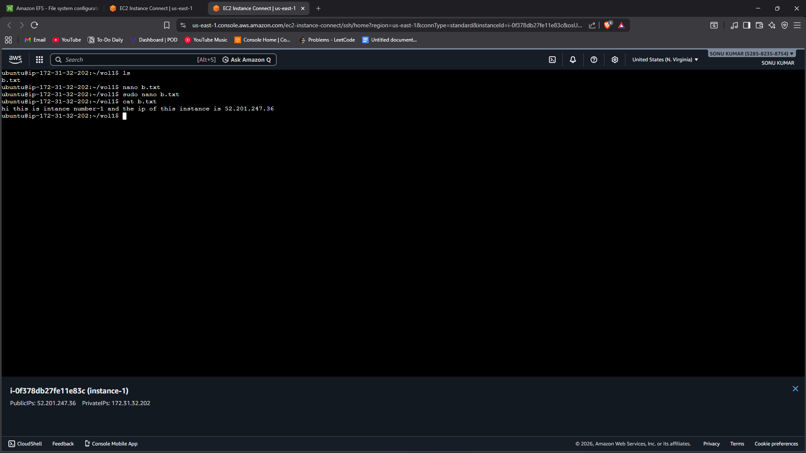
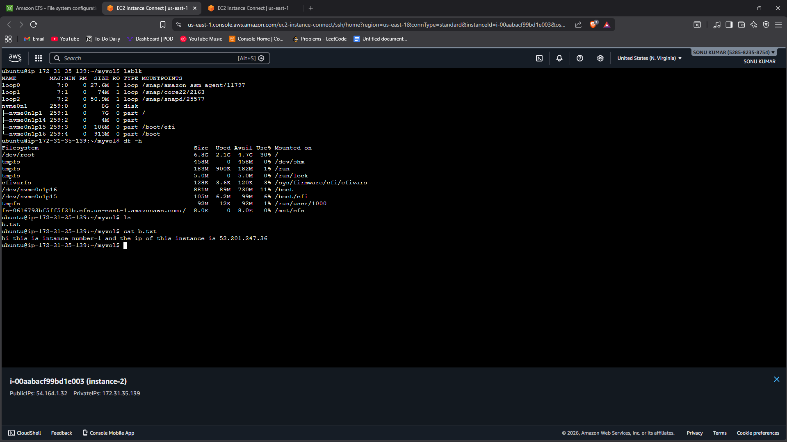

# Task 7 - Create EFS and Connect to Multiple Ubuntu EC2 Instances

## 📌 Objective
To create an Amazon Elastic File System (EFS) and mount it across multiple Ubuntu EC2 instances.

This task demonstrates shared, scalable file storage in AWS.

---

## 🛠️ Services Used
- Amazon EC2 (Ubuntu)
- Amazon EFS (Elastic File System)
- NFS Protocol
- Security Groups

---

## 🌍 Implementation Steps

### Step 1: Launch EC2 Instances
1. Launch two Ubuntu EC2 instances in the same VPC.
2. Ensure both instances are in subnets that can communicate.
3. Configure Security Group:
   - Allow SSH (Port 22)
   - Allow NFS (Port 2049)

---

### Step 2: Create EFS File System
1. Open AWS Console → EFS.
2. Click **Create file system**.
3. Select VPC.
4. Configure mount targets in required Availability Zones.
5. Attach security group allowing NFS (2049).
6. Create EFS.

---

### Step 3: Install NFS Client on Ubuntu Instances

Connect to each EC2 instance and run:

```bash
sudo apt update -y
sudo apt install nfs-common -y
```

---

### Step 4: Mount EFS on Both Instances

1. Create a mount directory:

```bash
sudo mkdir /mnt/efs
```

2. Mount the EFS:

```bash
sudo mount -t nfs4 -o nfsvers=4.1 fs-xxxxxxx.efs.region.amazonaws.com:/ /mnt/efs
```

(Replace `fs-xxxxxxx` and region with your actual EFS ID.)

---

### Step 5: Test Shared Storage

1. On Instance 1:
   ```bash
   echo "Hello from Instance 1" | sudo tee /mnt/efs/test.txt
   ```

2. On Instance 2:
   ```bash
   cat /mnt/efs/test.txt
   ```

If the file is visible on both instances, shared storage is working correctly.

---

## 📷 Proof of Work (Screenshots Required)

1. Screenshot showing:
   - EFS file system with mount targets.


2. Screenshot showing:
   - NFS mount command executed on EC2.


3. Screenshot showing:
   - File created on one instance and visible on another.



---

## 🔍 Key Concepts Learned

### 📁 Amazon EFS
- Fully managed scalable file system.
- Supports multiple EC2 instances simultaneously.
- Automatically scales storage as files grow.

### 🔄 Shared Storage
- Data is instantly available to all mounted instances.
- Useful for web servers, content management systems, and shared workloads.

### ⚙️ NFS Protocol
- EFS uses NFS (Network File System).
- Default port: 2049.

---

## 📊 Why EFS is Important

- Enables horizontal scaling.
- Ideal for multi-instance applications.
- Highly available across Availability Zones.
- No manual disk management required.

---

## 🎯 Conclusion

In this task, an Amazon EFS file system was created and successfully mounted on multiple Ubuntu EC2 instances using NFS.

Data created on one instance was accessible from another, proving shared and scalable storage functionality in AWS.