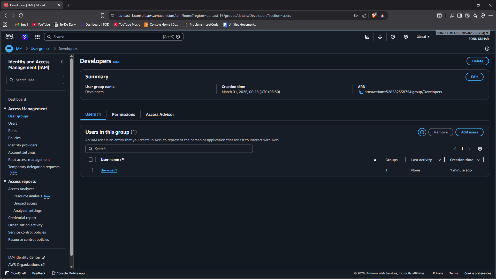
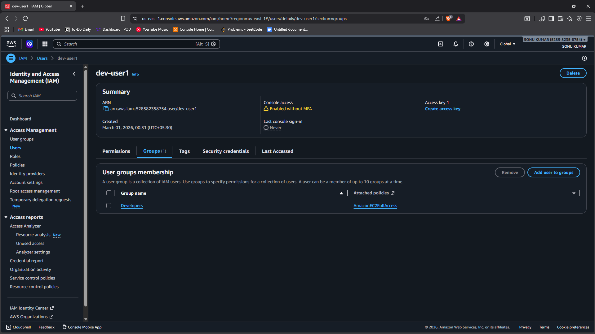
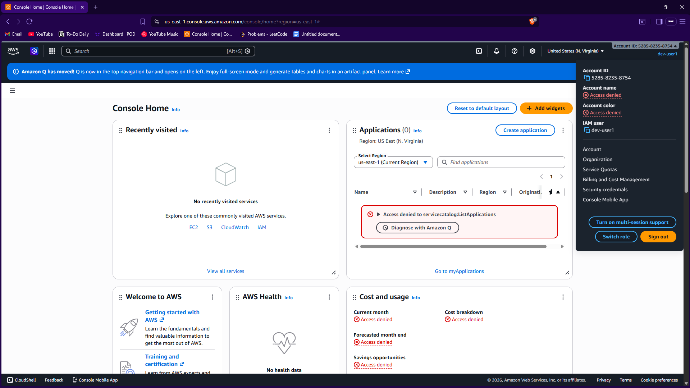

# Task 8 - Create IAM Users and Groups

## 📌 Objective
To create IAM users and groups and assign permissions using policies in order to understand access control and security management in AWS.

This task demonstrates how AWS Identity and Access Management (IAM) controls user access to cloud resources.

---

## 🛠️ Service Used
- AWS IAM (Identity and Access Management)

---

## 🔐 Implementation Steps

### Step 1: Create IAM Group
1. Open AWS Console → IAM.
2. Go to **User Groups**.
3. Click **Create group**.
4. Enter group name (e.g., Developers).
5. Attach required policies:
   - AmazonS3FullAccess (example)
6. Create group.

---

### Step 2: Create IAM User
1. Go to **Users** → Click **Create user**.
2. Enter user name (e.g., dev-user1).
3. Select access type:
   - AWS Management Console access
   - Programmatic access (if required)
4. Set password (auto-generated or custom).

---

### Step 3: Add User to Group
1. Select the created group (Developers).
2. Add the user to the group.
3. Confirm membership.

Now the user inherits permissions from the group.

---

### Step 4: Verify Permissions
1. Log out from root account.
2. Log in using IAM user credentials.
3. Verify access to permitted services (e.g., S3).
4. Confirm restricted services are inaccessible.

---

## 📷 Proof of Work (Screenshots Required)

1. Screenshot showing:
   - IAM Group with attached policies.

2. Screenshot showing:
   - IAM User created and added to the group.

3. IAM user logging console.

---

## 🔍 Key Concepts Learned

### 👤 IAM User
- Represents an individual person or application.
- Has specific credentials (password/access keys).

### 👥 IAM Group
- Collection of users.
- Permissions assigned to group are inherited by users.

### 📜 IAM Policy
- JSON document defining permissions.
- Controls what actions are allowed or denied.

---

## 🔐 Why IAM is Important

- Implements principle of least privilege.
- Prevents unauthorized access.
- Enhances AWS security.
- Enables centralized access management.

---

## 🎯 Conclusion

In this task, IAM users and groups were successfully created and policies were attached to manage permissions.

This demonstrates proper access control and security management in AWS.