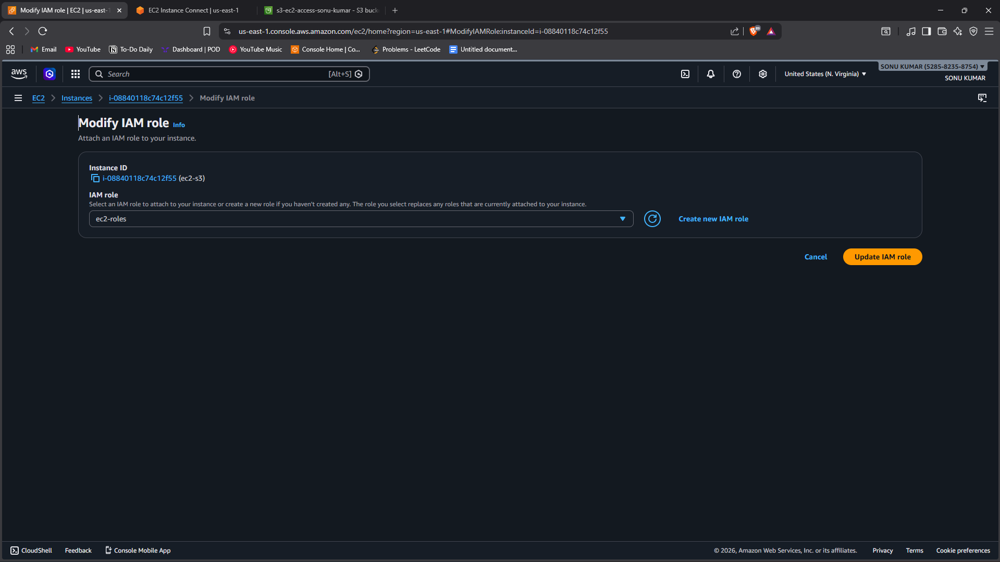
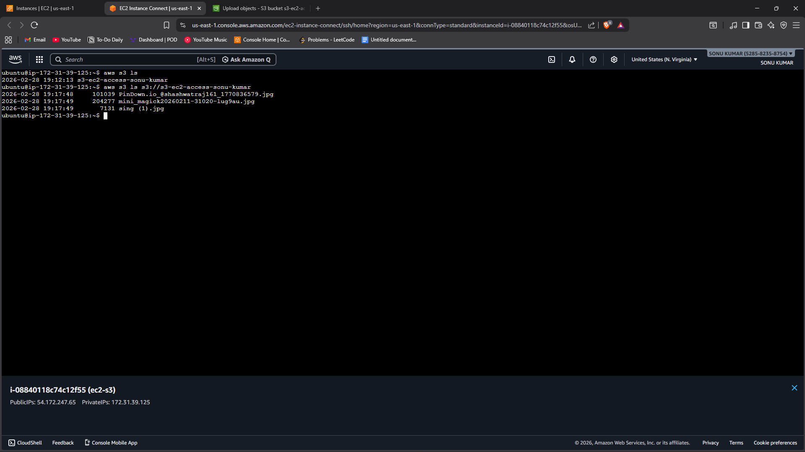

# Task 9 - Access S3 from Ubuntu using IAM Roles & Policies

## 📌 Objective
To securely access Amazon S3 from an Ubuntu EC2 instance using an IAM Role instead of access keys.

This task demonstrates role-based access control and avoids hardcoding AWS credentials.

---

## 🛠️ Services Used
- Amazon EC2 (Ubuntu)
- Amazon S3
- IAM Role
- IAM Policy
- AWS CLI

---

## 🔐 Implementation Steps

### Step 1: Create IAM Role for EC2
1. Open AWS Console → IAM.
2. Click **Roles** → Create role.
3. Select **Trusted entity type** → AWS service.
4. Choose **EC2**.
5. Attach policy:
   - AmazonS3FullAccess (or custom S3 policy).
6. Name the role (e.g., EC2-S3-Role).
7. Create role.

---

### Step 2: Attach Role to EC2 Instance
1. Go to EC2 Dashboard.
2. Select running Ubuntu instance.
3. Click **Actions → Security → Modify IAM role**.
4. Attach the created role.
5. Save changes.

---

### Step 3: Install AWS CLI on Ubuntu

Connect to EC2 and run:

```bash
sudo apt update -y
sudo apt install awscli -y
```

Verify installation:

```bash
aws --version
```

---

### Step 4: Test S3 Access (Without Access Keys)

List S3 buckets:

```bash
aws s3 ls
```

Upload a test file:

```bash
echo "IAM Role Test" > test.txt
aws s3 cp test.txt s3://your-bucket-name/
```

Download file:

```bash
aws s3 ls s3://your-bucket-name/
```

(No access key or secret key was configured manually.)

---

## 📷 Proof of Work (Screenshots Required)

1. Screenshot showing:
   - IAM Role attached to EC2 instance.


2. Screenshot showing:
   - Successful S3 access from Ubuntu terminal.


3. Command output showing:
   - `aws s3 ls`
   - File upload confirmation.

(All screenshots inside the Screenshots folder.)

---

## 🔍 Key Concepts Learned

### 🔑 IAM Role
- Temporary credentials automatically provided to EC2.
- More secure than storing access keys.

### 🛡️ Role-Based Access
- Follows best security practice.
- Eliminates risk of credential leakage.

### 🔄 Temporary Security Credentials
- Automatically rotated by AWS.
- Managed through Instance Metadata Service.

---

## 📊 Why This is Important

- Enhances security.
- Implements principle of least privilege.
- Used in real-world production environments.
- Required for DevOps and cloud automation roles.

---

## 🎯 Conclusion

In this task, an IAM Role was created and attached to an Ubuntu EC2 instance.  
S3 access was successfully tested using AWS CLI without configuring access keys manually.

This demonstrates secure and best-practice role-based access control in AWS.